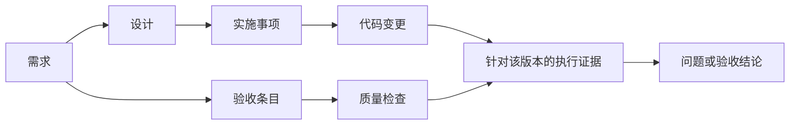

# WorkHub：个人工程管理平台需求草案

> 更新说明（2026-09-19）：原则仅属于任务；新增需求分组、拒绝/回收站与结构化测试追溯。下文是原始规划，冲突处以 [任务追溯更新](task-traceability.md) 和实现状态为准。

状态：供评审的设计草案，尚未实现。日期：2026-09-18。修订：加入随手待办、基本原则、内置智能体和自动报表。

配套文档：[系统设计](./system-design.md)。

## 1. 产品目标与当前假设

面向一个开发者同时使用多个外部 Agent 的工作方式，以“任务”为中心，把需求、设计、实施、问题、质量和评审组织为可追踪的工程记录。

用户应能在一个地方回答：要做什么、为什么这样做、目前做到哪里、有什么风险、哪些结论有证据、现在需要我决定什么。

已明确的需求：

- 一个任务对应一个开发事项，支持 BUG 修复和大型 feature。
- 一个任务内管理需求、多份设计、issue、质量和进度。
- 所有核心内容支持人工创建和编辑，也有 Agent 可调用的 API。
- 现有 Agent 继续承担需求、开发、质量工作，平台统一承接结果、评审和进度。
- 部署到自己的服务器，通过浏览器跨设备访问。
- HTTP API 和 MCP 两种 Agent 接入方式均需要支持。
- 提供随手记录 idea／待办的入口，供人工整理和 Agent 获取。
- 独立维护基本原则，并作为需求、设计和 Agent 工作的上下文。
- 配置 LLM API Key 后，启用系统／项目／任务问答、内容总结和任务自动概览。
- 自动生成需求追踪、质量覆盖等矩阵和报告。

以下是为了推进设计采用的假设，后续可调整：

- 首版是单人使用、一个服务实例，在自有服务器上部署。
- 支持多个项目，每个项目可登记多个代码仓库；首次使用自动创建默认项目。
- HTTP API 与 MCP 共用业务规则，首版同时交付两种接入方式。
- 外部开发 Agent 继续在现有工具运行；平台内置助手负责问答、总结、分析和修改草稿，首版不承担代码执行与外部 Agent 调度。
- 任务完成指本次工程事项通过约定验收；代码合并或发布是否必需，由任务模板决定。

产品效果以“减少一次任务需要人工反复打开、比对文档的次数”为主要观察指标。试用时记录完成一个小修复所需操作数、待决问题处理时间、找出未验证需求的时间；具体目标在真实任务试用后确定。

## 2. 用户与参与者

只有一个人类 Owner。需求 Agent、设计 Agent、开发 Agent、质量 Agent 是带身份和权限的参与者，不引入组织、部门、复杂团队管理。

参与者分工是默认权限模板，可以修改。例如开发 Agent 可以维护实施事项并提交验证结果，质量 Agent 可以提出问题并完成复核；最终需求确认、风险豁免和任务验收默认由 Owner 决定。

Agent 角色用于标注工作来源，并不能证明其结论正确。平台始终展示产物来源、版本、证据和确认人。

内置智能体使用独立系统身份，操作权限取当前授权范围与该身份允许能力的交集。自动生成概览可以直接保存为智能摘要；更改工程内容形成可审阅的草稿，批准、豁免和最终验收仍由 Owner 执行。

## 3. 核心对象与边界

| 对象                           | 含义                                         | 示例                               |
| ------------------------------ | -------------------------------------------- | ---------------------------------- |
| Project 项目                   | 长期工程背景，保存仓库、约束和模板           | 示例知识库                         |
| TodoItem 随手待办              | 尚未正式安排的 idea 或简单待办，可不属于项目 | 支持保存常用筛选条件               |
| Principle 基本原则             | 长期适用的设计约束、理由和适用范围           | 对外接口保持向后兼容               |
| Task 任务                      | 一个可以独立验收的开发事项                   | 文章搜索与筛选                     |
| Requirement 需求项             | 一项明确的能力或约束                         | 按关键词和分类查找文章             |
| AcceptanceCriterion 验收条目   | 能判断需求是否达成的条件                     | 不筛选时保持原有文章列表           |
| DesignDocument 设计文档        | 对实现方案的解释，可有多份                   | 搜索接口、筛选交互、兼容性说明     |
| WorkItem 实施事项              | 为完成任务需要执行的工作                     | 实现搜索表单、补充分页测试         |
| Issue 问题                     | 工作中发现的缺陷、疑问或风险                 | 切换分类后未重置页码               |
| QualityCheck 检查项            | 一项应执行的检查及判定方法                   | 搜索集成检查、浏览器回归、人工评审 |
| QualityRun 验证执行            | 检查在某个版本、环境的一次执行               | 针对 commit abc… 的回归执行        |
| Evidence 证据                  | 支撑结论的报告、日志、链接或人工记录         | 测试报告、复现日志、评审结论       |
| Review 评审                    | 对明确版本作出的意见与结论                   | 批准设计文档第 3 版                |
| Question / Decision 疑问与决策 | 需要 Owner 回答的问题及最终选择              | 保存筛选条件是否纳入本期           |
| AssistantSummary 智能摘要      | 基于明确来源版本生成的概况与建议             | 本任务主要阻塞和建议下一步         |
| ReportSnapshot 报告快照        | 某一时点、范围和口径下的统计及矩阵           | 文章搜索当前质量覆盖报告           |

Task、WorkItem、Issue 的关系必须清晰：

- 独立安排的 BUG fix 是 Task；为这个 Task 编写回归测试是 WorkItem；测试中发现另一个缺陷是 Issue。
- Issue 可以在当前任务内解决，也可提升为新 Task，并保留来源链接。
- 小任务可以没有 WorkItem；大任务才拆分实施事项。真正需要独立验收、独立排期时才拆成多个 Task。
- 跨任务依赖用关联表达。首版只显示依赖、环路错误和阻塞提示，不做自动排程。

## 4. 创建任务与模板

创建时只要求标题和简短目标；类型、流程模板可以自动给出默认值。任务创建后再逐步补充上下文。

任务字段包括：项目、编号、标题、类型、背景、目标、范围内／范围外、优先级、标签、总体状态、阻塞原因、目标版本、仓库引用、流程模板、可选截止时间。

任务类型首版支持 feature、bug、refactor、research、chore。类型与流程模板分离，例如简单 feature 也可以选择轻量模板。

### 4.1 轻量模板

适合小 BUG、配置修改、小范围改进：

1. 描述现象和预期行为；预期行为即可形成一个验收条目。
2. 实施修改；设计说明可以直接写在任务中。
3. 提交回归证据，检查阻塞问题，Owner 完成验收。

设计文档、实施拆分、单独需求评审均为可选。允许在一次页面操作中检查结果并确认完成。

### 4.2 标准模板

适合中大型 feature：

1. 明确需求和验收条目，确认本期范围。
2. 提交设计与关键决策，确认被标为必需的设计。
3. 分解实施事项，关联需求与代码变更。
4. 持续提交质量证据、处理发现的问题。
5. 对当前需求与目标代码版本完成最终验收。

这些活动允许重叠。探索性实现、测试设计和需求澄清可以并行；系统在关键确认点检查条件。

### 4.3 流程配置

首版提供有限配置：设计是否必需、哪些检查必需、哪些问题阻塞验收、最终验收是否要求代码合并。模板实例化后保存版本，修改项目默认模板不会悄悄改变现有任务。

减少步骤或跳过检查需要留下原因；Agent 可以提出申请，Owner 可以直接确认。每次豁免绑定具体检查和版本，需求或代码范围变化后重新检查其适用性。

## 5. 需求与验收条目

需求采用“结构化字段 + Markdown 说明”：名称、类型、优先级、范围、说明、验收条目、待决疑问、版本和确认状态。

验收条目具有稳定 ID，并记录判定方法、适用条件和所需证据。功能、兼容性、性能、资源使用、可靠性均可表达；没有确定的指标明确标为待定，不能自动视为满足。

需求页面提供两种视图：

- 列表：每项需求的确认状态、设计关联、实施关联、验证结论。
- 详情：正文、验收条目、关联内容、修改历史和评审讨论。

关键能力：

- Agent 批量提交需求，人工逐条编辑或批量确认。
- 需求新增、删除、变更显示相对于上次确认版本的差异。
- 评审与批准绑定具体版本；修改已确认内容产生新候选版本。
- 已确认版本继续可查，界面明确提示有待确认的更新。
- 删除已有引用的需求采用归档或撤销，不丢失历史追踪。

## 6. 设计与决策

一个任务下可以有多份设计文档，文档类型可选总体方案、模块设计、接口、数据结构、测试设计、迁移与兼容性、决策记录。

每份文档包含：标题、类型、摘要、Markdown 正文、关联需求、依赖文档、关键风险、待决问题、作者、版本和评审状态。模板仅提供建议内容，不要求填满每个栏目。

文档编辑支持 Markdown、代码块、表格和 Mermaid 图。首版采用保存时版本冲突检查；逐行实时协作不在首版范围。

评审体验应支持：

- 默认先看本次变化、影响范围和待决问题，再展开全文。
- 对整个文档或某个段落评论。段落评论绑定文档版本和引用文本，内容移动后可以标为位置已变化。
- 批准、要求修改、评论三类结论。
- 一次批准一组明确版本；提交期间内容变化会使该次批准失败并要求重新查看差异。
- 将有争议的方案抽成 Decision，记录候选方案、选定方案、理由和影响范围。

摘要由作者或 Agent 提交。结构差异由系统计算。摘要无法替代原文和逐项差异，重要内容可随时展开核对。

## 7. 实施、问题与进度

### 7.1 实施事项

WorkItem 字段：标题、目标、状态、负责人、关联需求／设计、依赖、完成条件、代码引用和可选估算权重。状态为 todo、doing、blocked、done、cancelled。

Agent 可以更新状态、记录阻塞、关联 branch／commit／PR、提交实施说明。首版登记链接和完整 commit SHA；自动读取 Git 平台状态放在后续迭代。

### 7.2 问题

Issue 字段：类型、严重程度、优先级、描述、复现步骤、期望／实际结果、发现环境、影响范围、关联证据、负责人和状态。

默认流程为 open → in_progress → resolved → verified → closed，允许 reopen。resolved 表示声称已修复，verified 表示已经完成复核，平台保留两者区别。人工可以按权限一次完成复核与关闭。

Issue 可设为阻塞项；延期、重复、无法复现、接受风险都有明确处置理由。首版用显式阻塞标记，模板可以按严重程度提供默认值。

疑问与缺陷在同一入口可查，但需要 Owner 决策的问题进入“待我处理”；一般问题不会制造额外审批。

### 7.3 进度

任务整体状态采用 draft、active、blocked、ready_for_acceptance、done、cancelled。需求、设计、实施、验证分别显示自身状态，避免一个总状态掩盖并行工作。

默认显示事实计数，例如：

- 需求：已确认 4/5 项。
- 必需设计：已确认 2/3 份。
- 实施：已完成 6/8 项，其中 1 项阻塞。
- 当前验收：通过 9/12 条，失败 1 条，待复验 2 条。
- 问题：仍有 1 个阻塞问题。

若展示实施完成率，公式为已完成有效事项权重 / 全部有效事项权重，默认权重为 1；必须同时显示分子分母。它只表示实施清单进度，不能代表验收或质量。

Agent 自报的“进度 80%”可以作为备注保存，不改变系统计算的结果。没有活动只表示状态未知，不推断 Agent 崩溃或任务完成。

## 8. 质量与证据

质量覆盖测试、静态检查、性能基准、人工评审和必要的专项检查。每个任务只启用与本次修改相关的检查。

QualityCheck 描述检查对象、方法、通过条件、关联验收条目和是否必需。QualityRun 保存一次执行的环境、起止时间、工具版本、检查项版本、需求基线、代码版本、结果与报告。

结果必须能区分 passed、failed、blocked、skipped、not_run、error。重跑产生新记录；旧失败和旧通过均保留，不能覆盖历史。

证据可以是结构化测试结果、附件、外部报告链接、带理由的人工验证记录。单纯写一句“已通过”会被标为缺少支撑材料。

### 8.1 追踪链



关联按需填写。小修复可以直接建立“验收条目 → 回归证据”，无需为了完整图谱增加空文档。

### 8.2 有效性与证据来源

- 验收结论针对明确的验收条目版本与目标代码版本。
- 需求实质变更后，相关设计和证据显示需要复查；未变更内容的历史结论仍保留。
- 首版对正文和验收条件变更采取保守失效策略；标题、标签等展示性字段可列入不影响结论的白名单。
- 目标 commit 或未提交补丁发生变化，先前运行保留为历史结果；默认不自动认定它能覆盖新版本。
- 未提交工作区需要 commit SHA 加补丁摘要；仅记录 branch 名称不能唯一确定被验证的代码。
- 同一检查在同一目标上的最新有效尝试若失败或出错，不能因为存在更早的通过结果而显示通过。
- 缺失代码版本或需求版本的证据显示“适用范围未确认”。Owner 可补全信息或作有理由的豁免。
- 外部 Agent 上传的数据标注为“Agent 上报”；Owner 确认和后续可信 CI 导入具有各自的来源标记。内容哈希用于发现文件变化，不能证明测试真实执行过。

“设计已修改”先触发相关内容复查；系统不声称能自动判断任意自然语言变更是否影响代码。

### 8.3 验收视图

按验收条目聚合展示：通过、失败、缺少验证、待复验、已豁免、不适用。每个结论能下钻到具体运行或人工记录。

同时区分：有检查关联、实际执行过、证据仍适用、结果通过。不能把“关联了测试用例”当作“验收已通过”。

## 9. 评审、变更与完成条件

评审对象可以是需求、设计或最终验收包。评审请求固定目标版本列表，并携带摘要、差异、待决问题和建议下一步。

Owner 可以逐项处理，也可以批量处理已阅读的版本。Owner 编辑内容时可选择“保存草稿”或“保存并确认”，避免自己的简单修改再走多次操作。

通过评审后修改内容会产生新候选版本，原批准记录保留。新评审通过后更新当前确认版本，相关验证适用性重新计算。

默认的最终验收条件：

1. 本次范围已经确定，没有未处理的范围变更或阻塞疑问。
2. 模板要求的需求和设计已有当前有效的确认。
3. 所有必需验收条目都有当前有效的通过证据，或有 Owner 对当前范围的明确豁免。
4. 必需实施事项已完成，没有未处置的阻塞 Issue。
5. 所需代码引用已登记；模板若要求合并，需有合并状态依据或人工确认。
6. 当前采用的必需原则已有约定的检查／人工确认，已确认的原则冲突已解决或具有有效例外。

Agent 可以申请最终验收。系统返回尚缺哪些条件，Owner 最终确认。不能通过普通 PATCH 状态字段绕过验收规则。

验收保存当时的需求、设计、检查、证据、代码版本及豁免快照。done 后实质修改应先重新打开任务，保留原验收记录并创建新的一轮验收。

## 10. 页面与交互

### 10.1 工作台

首页以“待我处理”为首屏：待确认的需求／设计、需要回答的问题、未处置的阻塞、过期证据、可最终验收的任务。

同一任务的相关通知合并；已读、已处理和暂缓区分保存。排序先看阻塞与决策，再看普通更新，避免每次 Agent 写入都生成一个提醒。

下方显示进行中任务、最近变更和快速新建。全局搜索支持任务编号、标题、标签和正文检索。

主导航增加“待办事项”“基本原则”“智能助手”“报告”。顶部保留随手记入口；“待办事项”保存用户主动记录的内容，“待我处理”是按系统状态生成的处理清单，两者可互相链接。

### 10.2 任务工作区

固定顶部显示任务目标、状态、代码目标、阻塞和下一步建议。

页面导航：概览、需求、设计、实施、问题、质量、活动。评审以侧栏或专用页面展示；不要求用户反复跳转全文。

任务概览增加适用原则、智能摘要和“询问此任务”入口。质量页可直接打开覆盖矩阵；报告也能从全局报告入口按项目和任务检索。

概览默认包含：

```text
TASK-018  文章搜索与筛选                         [进行中]
目标：让读者更容易找到需要的文章

待你处理：1 个设计变更 · 1 个范围问题
阻塞事项：ISS-12 切换分类后出现错误的空结果

需求 4/5  | 必需设计 2/3 | 实施 6/8 | 当前验收 9/12

上次查看后的变化
  - 筛选交互设计 v3：调整分页重置规则，影响 AC-04
  - 新增回归记录：2 项通过，1 项失败
  - 开发 Agent：完成搜索接口，等待筛选交互确认

建议下一步：确认筛选交互，然后执行关联回归检查
```

以上数字为界面示例，不代表已有任务数据。

### 10.3 追踪矩阵与评审视图

追踪矩阵以验收条目为行，展示关联设计、实施、检查、最新证据和缺口。它与任务概览共享同一后端计算结果。

评审默认展示变更摘要、结构化差异、风险、未决评论和影响范围，支持展开全文、修改、批量确认或要求修改。

### 10.4 Agent 接入设置

创建、命名、限制和撤销 Agent 凭证；复制 API 地址、MCP 地址、任务 ID 和上下文入口。HTTP 脚本使用 Token；支持远程授权的 MCP 客户端使用授权连接，必要时提供本地 stdio 桥接。提供一次可用的请求示例与权限检查结果，不要求用户手工组织全部背景材料。

## 11. Agent 工作协议

一次典型流程：

1. 用户创建任务，将任务链接／ID 提供给外部 Agent。
2. Agent 获取角色相关的任务上下文包，读取已确认版本、候选变更、相关问题、代码目标和所需输出结构。
3. Agent 提交结构化需求、设计、实施记录或质量记录；长文本正文用 Markdown。
4. 需要人类决定时创建 Question；需要评审时创建 ReviewRequest。
5. 平台更新“待我处理”和任务进度。
6. Agent 再次读取上下文或增量事件，按最新决策继续工作。

上下文读取和写入都要有版本信息。收到冲突后，Agent 必须重新读取并合并；重试不会重复创建对象。

第二阶段支持一批相关修改形成一个提交包，提供总体摘要并原子提交。首版先支持单对象写入和多对象版本的批量评审。

Agent 可以提交推荐结论；权限和完成条件由后端验证。文档中的自然语言不能改变凭证权限或替代 Owner 的确认。

## 12. 非功能需求

- 服务器部署完成后可跨设备登录；常规页面、编辑与评审不依赖外部 LLM 服务。
- 未配置 LLM 或服务不可用时，待办、原则、结构化概览、矩阵、确定性报告与外部 Agent API 仍正常工作；智能功能明确展示未启用、失败或暂停原因。
- Agent 可同时读写；陈旧更新不会覆盖新内容，网络重试不会制造重复数据。
- 核心写入、审计和事件记录要么同时提交，要么一起回滚。
- 内容可导出为 JSON + Markdown + 附件，保留 ID、版本和关联；具备备份与恢复路径。
- 基础检索、筛选和分页支持长期个人积累；中文正文搜索必须有明确的首版实现。
- 通过 HTTPS 提供统一入口，内部应用与数据库不直接暴露公网；凭证可撤销、权限可限制到项目或任务，凭证本体不进入日志。
- Markdown 与附件按照不可信内容处理；外部链接默认只登记，不由服务任意抓取。
- 草案容量目标：1 名用户、约 5 个并发 Agent、1 万个累计任务；常见列表和上下文摘要 API 的 P95 目标为 500ms 以内。硬件与数据规模在实现时固定并测试，这些是目标而非现有测量结果。

## 13. 版本规划

### 第一阶段：贯通一个真实的小修复

- 项目、任务、轻量／标准模板。
- 需求与验收条目、多份设计文档。
- WorkItem 与 Issue。
- 检查、运行结果、证据关联与验收矩阵。
- 最小可用的版本、差异、评审、疑问和 Owner 确认。
- 工作台、任务概览、活动记录。
- 全量核心 REST API、OpenAPI、任务上下文包。
- MCP 核心工具与远程连接鉴权，验证真实聊天／IDE 客户端的连接、读取和写入。
- 基本鉴权、乐观锁、幂等、审计、导出及备份恢复。
- 随手待办、整理／转任务及 HTTP／MCP 访问。
- 全局／项目／任务原则库、版本、适用范围和上下文注入。
- LLM 配置、系统与任务问答、带引用的总结、事件触发的任务自动概览。
- 自动更新的需求追踪矩阵、质量覆盖矩阵，报告快照与 JSON／CSV／Markdown 导出。

可以分增量实现，但真正可用的第一版必须包含“Agent 写入 → 人工确认 → 验证证据 → 最终验收”闭环。

### 第二阶段：提高日常效率

- MCP 工具体验优化及更多客户端兼容性。
- JUnit 等常见报告导入、Git／CI 状态同步。
- 评审段落定位、增强文本 diff、事件推送、Webhook。
- 批量提交包、增量上下文、任务依赖和问题转任务。
- 更多任务模板与检索能力。
- 周期性日报／周报、多期趋势、复杂报告模板和更多 LLM 提供方适配。

### 后续按需扩展

跨任务知识沉淀、项目级架构文档、风险趋势、代码执行与外部 Agent 编排、多用户支持。首版无需组织权限系统、可视化流程设计器、向量数据库或独立消息集群。

## 14. 首版验收场景

1. 从空项目创建小 BUG 任务，补充一个验收条目；无需独立设计文档即可提交修复证据并完成验收。
2. 创建文章搜索 feature，维护至少两份设计；能从任一验收条目找到对应检查和证据。
3. Agent 通过 API 创建或修改核心内容后，UI 显示与 API 一致的版本和状态。
4. 人和两个 Agent 同时修改同一对象时，陈旧写入被拒绝，已有修改不丢失。
5. 同一创建请求重试多次仅生成一条记录；同一个幂等键携带不同内容被拒绝。
6. 已批准的设计修改后，原批准仍可查，新版本显示待确认；旧评审请求不能批准新内容。
7. 验收条目或目标代码变更后，受影响的旧证据不继续算作当前通过。
8. 一个验收条目有多个必需检查时，任何一个缺失、失败或出错均不能汇总为通过。
9. 最新检查失败不会被旧通过覆盖；跳过和未运行不计为通过。
10. 缺少必需证据或存在阻塞 Issue 时，完成任务返回具体原因；Owner 的版本限定豁免被记录。
11. Agent 凭证不能执行未授权的确认或修改其他任务；人工 UI 也受同一业务规则约束。
12. 从备份恢复后，任务、版本、评审、附件和关联均可读取，并能继续编辑。
13. 在两台设备上访问同一服务器，读取相同任务；HTTP Agent 与 MCP 客户端提交的内容进入同一评审和审计流程。
14. MCP 授权、凭证过期／撤销与断线重试行为经过目标客户端验证，重试不会重复写入数据。
15. 删除验收条目、降低检查要求或移除验证关联会触发范围变更确认，不能让 Agent 通过删减要求直接使任务通过验收。
16. 无需选择项目即可记录一句 idea，Agent 能按权限读取；读取不使待办消失，转任务后保留原文与关联，重试不创建重复任务。
17. 项目任务上下文包含适用的全局、项目和任务原则；原则更新提示采用新版本，已完成任务仍可查看原有原则快照。
18. 配置 LLM 后，可以询问单任务阻塞和跨项目未验证事项；答案附来源，无记录时明确说明，任务范围对话不会自动读取其他任务。
19. Agent 分析过程中源内容发生变化时，旧结果标为过期；自动概览不会用较晚完成的旧运行覆盖新概览，也不会触发自身无限重新生成。
20. LLM 凭证不能通过读取配置、聊天、日志、MCP 或普通导出取回；额度不足、超时、取消和重启不影响工程状态。
21. 无 LLM Key 也能生成矩阵；统计显示分子分母，未运行、待复验、豁免和不适用分别展示，空范围不显示 100% 覆盖。
22. AI 提出的修改经预览后通过原业务接口应用；版本变化、越权或不满足验收条件时仍被拒绝。

## 15. 文章搜索功能的示例闭环

创建任务“文章搜索与筛选”，采用标准模板。需求 Agent 提交关键词搜索、分类筛选、分页导航与兼容性要求；尚未确定的结果排序规则作为疑问单独提出。

Owner 确认本期范围后，设计 Agent 提交搜索接口和筛选交互两份文档，把“是否支持保存常用筛选条件”列为待决问题。Owner 决定首版不支持，系统把决定关联回需求与设计。

开发 Agent 读取已确认版本，拆分搜索表单、分类接口、分页交互与回归测试事项，提交代码引用。质量 Agent 按验收条目回写不同关键词、分类切换、空结果和原有浏览体验检查的运行证据。

若集成检查发现切换分类后页码未重置，创建阻塞 Issue 并关联失败记录；开发修复后登记新 commit，质量 Agent 对新目标复验。旧结果保留，但页面使用新目标对应的证据。

Owner 最后查看变更、剩余问题和验收矩阵，对当前版本完成验收。整个过程中，完整设计仍可阅读，但日常处理主要集中在结构化差异、待决问题和证据缺口。

## 16. 随手待办与想法收集

提供固定的“随手记”入口，支持一句话快速保存、稍后补充说明、链接和标签。项目、优先级、计划时间均可选，未选项目的内容进入全局待办箱。首版以文本输入为主。

待办类型可选 idea、todo，状态为 inbox（待整理）、planned（已安排）、converted（已转任务）、done（已完成）、archived（已归档）。简单待办可直接完成；转任务只表示已经正式安排，界面另显示关联任务的实际进度。

支持编辑、筛选、搜索、归档、恢复、关联已有任务，或选中一条／多条创建任务。转化保留原文、创建时间、来源 ID 和目标关联；可从任务追溯最初的想法。原记录不会被替换成 Agent 改写后的内容。

外部 Agent 可通过 HTTP／MCP 获取待整理内容、检索想法、提交整理建议。具备相应权限后可以创建或修改待办、将其转成任务。GET 读取不改变待办状态，多个 Agent 分别维护自己的增量读取位置，避免一个 Agent 读过后其他 Agent 看不到。

内置助手可按主题归类、提示相似想法、建议拆分和优先级，也可从已有讨论生成待办草稿。合并、归档和转任务由显式操作执行。任务范围凭证只可读取已关联且授权可见的待办。

## 17. 基本原则库

基本原则作为独立类别维护，可按架构、接口、数据、编码、质量等标签分类。每条记录有稳定编号、名称、规则正文、理由、适用范围、强度（必需／建议）、示例、验证指引、版本和状态。

适用范围包括全局、项目、任务。实际原则集合由全局有效原则、项目有效原则、任务补充原则组成。更窄范围可补充约束；发生冲突时明确提示，不能仅因范围更窄就静默覆盖必需原则。

示例仅用于说明表达方式，是否启用由 Owner 决定：

- 对外接口变更应保持约定的兼容性，并提供兼容性验证。
- 所有用户输入必须经过校验，并给出清晰的错误提示。
- 关键错误路径应可被观测，并具备相应验证方法。

原则状态为 draft、active、deprecated，发布和修订纳入评审。新任务采用当前有效原则；现有任务固定已采用版本，原则更新后显示待采用／待复查，确认后推进新基线；历史任务和报告保留原快照。明确的例外需记录理由、适用任务、原则版本和有效范围。

内外部 Agent 获取任务上下文时自动获得适用原则、版本和例外。设计文档可以关联自己遵循的原则；内置助手可识别可能的冲突并附依据。

自然语言原则的满足情况由明确的检查或人工评审确认。规则可以自动检查时使用确定性检查；LLM 的“可能违反”属于待核实发现，经确认后再成为阻塞项。

## 18. 内置智能助手

### 18.1 使用入口与范围

全局入口可针对授权可见的整个管理系统进行问答，项目和任务入口默认限制在当前范围。每次对话明确显示范围，扩展到其他项目／任务要通过显式选择。

典型问题包括：“这个任务目前卡在哪里？”“哪些需求没有有效验证？”“筛选交互为什么这样设计？”“本周做了什么？”“待办里哪些想法与文章搜索有关？”

答案区分平台事实、来源中的结论和助手建议；事实附可点击的对象／版本引用。无数据、证据过期或检索不完整时说明限制。历史对话保存当时的回答与依据，再次提问时读取当前内容。

### 18.2 能力与操作

- 查询任务、需求、设计、问题、原则、待办与报告，解释状态和决策。
- 总结文档、任务或跨任务工作，归纳变更、阻塞、风险与下一步。
- 生成需求、设计、待办或问题的修改草稿，展示具体字段和差异后应用。
- 自动生成任务概览，并对确定性报告提供可选的文字解读。

分析过程默认只读取业务数据。智能摘要属于可自动更新的派生内容；工程记录修改通过预览及显式应用进入正常权限、版本与评审流程。助手不能自行批准自己的修改或将任务验收通过。

### 18.3 自动任务概览

结构固定为：目标与范围、当前阶段、已完成工作、阻塞、质量缺口、关键变化、建议下一步。事实计数直接取系统计算结果，文字由助手补充。

配置模型后可启用自动概览。在需求、设计、实施、问题、质量或已采用原则变化后合并触发一次更新，避免每次小修改都调用模型；同时支持手动刷新和关闭自动生成。摘要记录生成时间、来源版本和模型标识。

源数据变化后旧摘要标为待更新；生成期间又有修改时，过期结果只保留为历史，重新安排最新任务。摘要自身的写入不再次触发摘要任务。人工补充的备注单独保存，自动刷新不覆盖这些备注。

### 18.4 模型设置与运行体验

设置页配置提供方适配器、服务地址、模型、API Key，以及上下文上限、单次输出上限、超时、调用频率和预算。首版先完整验证一种选定的 API 协议；仅修改地址不能保证适配任意提供方。

API Key 仅由后端使用并加密保存，界面只显示掩码和是否已配置；支持连通性测试、更换和删除。设置页说明启用功能后，选定范围的工程内容会发送至配置的 LLM 服务；排除密钥、无关附件和超出权限的内容。

用户可查看运行状态、取消生成和重试，了解 token 用量及有价格配置时的费用估算。自动任务达到配置限额后暂停并显示原因；提供方超时／报错保留已有摘要，基础管理功能照常使用。应用预算是防护与估算，实际计费以提供方为准。

## 19. 报告与覆盖矩阵

### 19.1 首版报告

| 报告           | 行粒度与主要列                                             | 用途                     |
| -------------- | ---------------------------------------------------------- | ------------------------ |
| 需求追踪矩阵   | 每条验收标准：需求、设计、实施、代码引用、检查、证据、结论 | 检查从需求到验收是否完整 |
| 质量覆盖矩阵   | 每条验收标准 × 适用检查类型，显示状态和证据                | 找出遗漏、失败、过期验证 |
| 任务概况报告   | 范围、各阶段计数、问题、决策、验收缺口、时间               | 快速了解任务整体情况     |
| 问题与风险清单 | 严重度、阻塞、处置、关联任务、最新变化                     | 汇总待处理的工程风险     |

质量矩阵示例：

| 验收标准             | 单元检查 | 集成检查         | 兼容性检查       | 当前结论 |
| -------------------- | -------- | ---------------- | ---------------- | -------- |
| 关键词搜索结果正确   | 通过     | 未运行           | 不适用（已确认） | 缺少验证 |
| 切换分类时重置页码   | 通过     | 失败             | 不适用（已确认） | 失败     |
| 未筛选时保持原有体验 | 通过     | 不适用（已确认） | 证据过期         | 待复验   |

示例中的适用性与结果均为说明数据。实际列按任务模板和检查定义生成；空白单元格不能自动解释成不适用，相关检查缺失需显示缺口。这里的覆盖表示需求／验收覆盖，代码行或分支覆盖需来自单独的工具报告。

### 19.2 统计口径

覆盖率按明确的验收条目集合计算，并展示分子／分母。至少区分“已关联检查”“必需检查已执行”“当前有效证据全部通过”；关联了检查仅说明已有计划，不等于已经验证。

豁免、不适用、未运行、失败和待复验单独计数。豁免不计为通过；只有经确认的不适用条目从适用分母中排除，排除数量与理由仍展示。没有适用条目时显示无适用数据。需求级汇总只有在其所有适用必需验收条目通过时才显示通过。

### 19.3 更新、快照与导出

在线矩阵随工程数据变化自动更新，无需配置 LLM。用户可按项目、任务、版本、代码目标和状态筛选，点击单元格查看来源。

任务验收时自动保留报告快照，也支持手动保存任一时点报告；快照固定数据范围、统计口径、版本、代码目标和生成时间，后续更新不会修改旧报告。统计数据完整计算，LLM 只对这份结果添加可选解读，不能编造计数或自行扩大范围。

首版支持网页查看与 JSON／CSV／Markdown 导出，导出同时携带范围和口径信息。周期性日报／周报、多期趋势和精细打印排版在第二阶段扩展；日程与时区需由配置明确。
