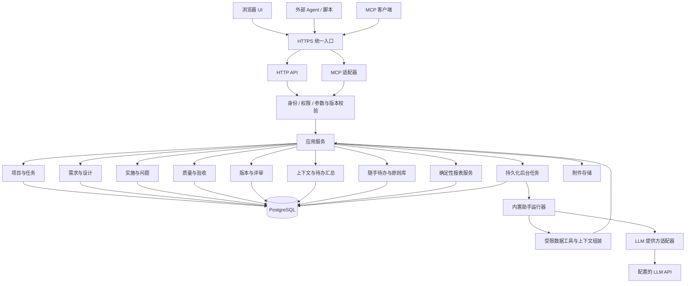

# WorkHub：系统设计草案

> 更新说明（2026-09-19）：原则仅属于任务；新增需求分组、拒绝/回收站与结构化测试追溯。下文是原始规划，冲突处以 [任务追溯更新](task-traceability.md) 和实现状态为准。

状态：供评审的技术方案，尚未实现。日期：2026-09-18。修订：加入随手待办、基本原则、内置智能体和自动报表。

产品行为与验收范围见[需求草案](./product-requirements.md)。本文件中的接口和表结构为拟议契约，落地时需形成可执行的 Schema 与迁移。

## 1. 架构决定

建议使用模块化单体：一个后端承载业务规则，浏览器 UI、外部 Agent 与 MCP 适配器访问同一套应用服务。根据已确认需求，部署于自有服务器、支持跨设备访问，首版同时交付 HTTP 与 MCP；规模先按个人、单服务实例设计。



模块在一个应用进程中运行，通过清晰的服务接口协作。数据库事务保证关键业务状态的一致性，附件通过受控持久化与备份清单协调。界面由同一服务提供静态资源，使用反向代理、应用服务、PostgreSQL 和附件数据卷组成部署单元。

首版包含可配置的内置助手，用于问答、总结、分析和任务自动概览。未配置 LLM 时，核心工程管理和确定性报表仍然可用。权限判断、统计计算、验收规则由业务服务执行，模型输出不能替代这些规则。

后台运行器先作为同一部署中的逻辑模块，按需独立成 worker 进程；以 PostgreSQL 持久化作业和状态，首版无需独立消息集群。LLM 请求在数据库事务之外执行，避免阻塞工程数据写入。

## 2. 技术选型建议

| 部分       | 首版建议                                   | 取舍                                                |
| ---------- | ------------------------------------------ | --------------------------------------------------- |
| 前端       | React + TypeScript                         | 适合表单、列表、差异视图和关联导航                  |
| 后端       | TypeScript + Fastify                       | 便于构建 API，并以请求／响应 Schema 约束 Agent 输入 |
| 数据库     | PostgreSQL                                 | 适合服务器长期运行，提供事务、约束与并发控制        |
| API 契约   | REST JSON + OpenAPI 3.1.x                  | 形成机器可读接口契约，生成文档和客户端              |
| 正文       | Markdown 文本                              | Agent 易生成，人工易维护，可直接导出                |
| 附件       | 数据目录中的受控文件                       | 数据库保存元信息、大小和内容哈希                    |
| Agent 接入 | HTTP API + MCP Streamable HTTP             | 同时满足脚本调用与支持 MCP 的客户端                 |
| 内置智能体 | 服务端运行器 + LLM 提供方适配器            | 受限工具调用、来源引用、用量和失败管理              |
| 后台作业   | PostgreSQL 作业表 + 有界 worker            | 自动摘要、报告快照和导出，不在页面请求中等待长任务  |
| 报表       | 确定性查询 + 验收计算服务                  | 无 Key 也可生成矩阵；模型只补充解释                 |
| 部署       | Docker Compose + HTTPS 反向代理            | 统一管理应用、数据库、网络和持久卷                  |
| 前端刷新   | 首版定时增量拉取，后续 SSE                 | 先避免长连接部署和恢复逻辑占用首版范围              |
| 测试       | 业务规则单测、API 集成测试、少量端到端场景 | 优先验证并发、版本、权限和验收规则                  |

上述是工程判断，并非唯一可行组合。React 的组件模型可用于这些交互界面；Fastify 官方支持按 Schema 校验请求和序列化响应。正式实现时统一支持的 Schema 子集，验证运行时 Schema 与 OpenAPI 生成结果一致，不默认所有 JSON Schema 版本可以直接互换。[React 官方入门](https://react.dev/learn)、[Fastify 校验与序列化](https://fastify.dev/docs/latest/Reference/Validation-and-Serialization/)

OpenAPI 用于描述 HTTP 接口，包括参数、请求体、响应与安全定义。选择 3.1.x 是为了给实现工具链一个明确的兼容目标，实际依赖版本在开发时验证并锁定。[OpenAPI 3.1.2 规范](https://spec.openapis.org/oas/v3.1.2.html)

### 2.1 数据库与部署选择

本方案选择 PostgreSQL，主要考虑已确定的服务器部署、长期数据积累和可靠的并发写入。其事务隔离与锁定机制适合维护跨资源验收条件；应用层仍须处理乐观锁、幂等和事务边界。[PostgreSQL 并发控制](https://www.postgresql.org/docs/current/mvcc.html)

SQLite 在单服务实例下也能通过短事务排队支持并发请求。这里选择 PostgreSQL 是对当前部署方式和维护取舍的判断；首版集中实现和测试这一种数据库。[SQLite 适用场景](https://www.sqlite.org/whentouse.html)

Docker Compose 可统一定义和管理多容器应用的服务、网络与卷，适合这类单服务器部署。[Docker Compose 官方文档](https://docs.docker.com/compose/)

建议仅对外开放 HTTPS 入口：`/` 提供 UI，`/api/v1` 提供 REST，`/mcp` 提供 MCP；数据库端口和附件目录仅在内部可达。预留健康检查、日志轮换、迁移命令、备份命令和升级前检查，不要求 Kubernetes。

开发环境也使用相同类型的数据库。发布时先备份，再执行兼容性迁移与健康检查；应用版本回退须核对 Schema 兼容性。首次部署的服务器系统、域名和证书方式在实施阶段确认。

## 3. 模块职责

| 模块             | 职责                                             |
| ---------------- | ------------------------------------------------ |
| Identity         | 单人账户、Agent 身份、凭证、权限范围             |
| Projects / Tasks | 项目背景、仓库登记、任务、模板、状态转换         |
| Todos            | 随手记录、整理状态、任务转化和来源关系           |
| Principles       | 原则、适用范围、版本、例外和任务采用清单         |
| Requirements     | 需求、验收条目、范围基线                         |
| Designs          | 多份设计、文档版本、决策与疑问                   |
| Execution        | 实施事项、阻塞、代码引用                         |
| Issues           | 缺陷与风险生命周期、问题关联                     |
| Quality          | 检查定义、执行、结果、证据、适用性               |
| Reviews          | 评审请求、意见、批准、最终验收与豁免             |
| Context          | 角色相关上下文包、变更摘要、缺口信息             |
| Activity         | 审计记录、任务事件、“待我处理”查询               |
| Storage          | 附件、导出、备份与恢复                           |
| Assistant        | 对话、受限工具、运行记录、修改草稿与带来源的摘要 |
| ModelSettings    | 提供方配置、密钥保管、可用性测试与调用限额       |
| Reports          | 需求追踪、质量矩阵、快照、确定性指标和导出       |
| Jobs             | 持久化队列、合并触发、重试、取消和进程恢复       |

聚合指标由后端统一计算。UI 和 Agent 获取同一份概览、验收矩阵、阻塞原因和完成条件，避免各自重新解释状态。

## 4. 逻辑数据模型

### 4.1 核心实体

| 实体                | 主要字段                                                                                                                 |
| ------------------- | ------------------------------------------------------------------------------------------------------------------------ |
| Project             | id、key、name、description、policy、default_template                                                                     |
| Repository          | id、project_id、name、remote_url、default_branch                                                                         |
| Task                | id、project_id、number、type、title、goal、scope、status、template_snapshot、lock_version                                |
| Requirement         | id、task_id、key、priority、head_revision_id、accepted_revision_id                                                       |
| AcceptanceCriterion | id、requirement_id、key、head_revision_id、accepted_revision_id                                                          |
| DesignDocument      | id、task_id、kind、required、head_revision_id、accepted_revision_id                                                      |
| WorkItem            | id、task_id、title、status、assignee_id、definition_of_done、weight、lock_version                                        |
| Issue               | id、task_id、kind、severity、blocking、status、assignee_id、resolution、lock_version                                     |
| QualityCheck        | id、task_id、kind、required、head_revision_id、accepted_revision_id                                                      |
| QualityRun          | id、task_id、baseline_id、code_snapshot_id（与代码无关的检查可空）、environment、status、source、started_at、finished_at |
| CheckResult         | id、run_id、check_revision_id、attempt_sequence、result、summary                                                         |
| Evidence            | id、task_id、result_id 可空、kind、attachment_id／url／note、source_actor_id                                             |
| CodeSnapshot        | id、task_id、repository_commits、patch_digests、build_reference                                                          |
| Baseline            | id、task_id、content_revision_manifest、principle_manifest、link_manifest、policy_snapshot、created_by                   |

实体 ID 使用不可变 UUID；人类可读编号如 TASK-018、REQ-02、AC-04 在项目或任务范围内唯一，修改标题不会改变引用。

验收条目的正文和判定条件纳入版本；需求确认应绑定其正文及验收条目版本集合。子条目修改会形成新的需求候选集合，不能沿用旧确认标记。

### 4.2 版本、评审与协作实体

| 实体               | 主要字段                                                                                             |
| ------------------ | ---------------------------------------------------------------------------------------------------- |
| Revision           | id、entity_ref、sequence、content_snapshot、change_summary、parent_revision_id、actor_id、created_at |
| TraceLink          | id、task_id、source_ref、target_ref、relation、source_revision_id 可空、target_revision_id 可空      |
| ReviewRequest      | id、scope_kind、scope_id、task_id 可空、target_manifest、status、summary、requested_by               |
| ReviewDecision     | id、request_id、target_manifest_hash、decision、comment、actor_id                                    |
| Comment            | id、task_id、target_ref、revision_id、quote_anchor、body、resolved_at                                |
| Question           | id、task_id、body、options、blocking、status、answer、decided_by                                     |
| Waiver             | id、task_id、target_manifest、code_snapshot_id、reason、actor_id、expires_at 可空                    |
| Acceptance         | id、task_id、baseline_id、code_snapshot_id、evidence_manifest、waiver_manifest、actor_id             |
| Actor / Credential | identity、role、credential_hash、scope、expiry、revoked_at                                           |
| ActivityEvent      | id、task_id、task_sequence、actor_id、kind、entity_ref、summary、created_at                          |
| IdempotencyRecord  | actor_id、operation_scope、key、request_hash、response、expires_at                                   |
| Attachment         | id、task_id、storage_key、original_name、size、mime_type、sha256                                     |

这些是逻辑实体，建表时可合并简单记录，避免仅为概念拆分过多表。核心领域字段应有独立校验；正文快照和环境信息可存 JSON。对象引用需要验证存在、类型、所属任务和权限，不能只有一个任意字符串链接。

通用 Revision 表若采用多态引用，必须有可执行的引用完整性方案，例如统一实体注册表加外键，或改为按实体建立版本表；不能只依赖 UI 保证引用正确。

首版 TraceLink 关系限定为 requirement/design/check/work_item 等明确允许的组合；后续再扩展自由关联。验收证据需指向具体版本，不能只关联不断变化的“最新文档”。

### 4.3 状态与事件的关系

业务表保存当前状态，不采用完整事件溯源。Revision 保存需要回看的内容快照，ActivityEvent 保存操作轨迹。三者在同一事务内更新。

检查结果与批准记录尽量追加保存；更正通过追加纠正／撤销记录完成，保留来源。未完成的运行可更新进行中状态；完成后的结果保持不可变。

关联表、当前指针和必要计数可按查询需要建立索引。优先索引 project_id、task_id、status、updated_at、entity_ref，以及编号／幂等键的唯一约束。

### 4.4 本次新增实体

| 实体                  | 主要字段                                                                                            |
| --------------------- | --------------------------------------------------------------------------------------------------- |
| TodoItem              | id、project_id 可空、kind、text、tags、priority、status、lock_version、created_by                   |
| TodoTaskLink          | todo_id、task_id、relation、source_revision、conversion_id                                          |
| Principle             | id、key、scope_kind、scope_id、category、strength、head_revision_id、accepted_revision_id、status   |
| PrincipleAdoption     | task_id、principle_id、revision_id、adoption_status、confirmed_by                                   |
| PrincipleException    | id、task_id、principle_revision_id、reason、scope、expiry、approved_by                              |
| LlmConnection         | id、adapter_id、base_url、model、secret_ref、limits、enabled、config_version                        |
| Secret                | id、ciphertext、key_version、created_at、rotated_at                                                 |
| AssistantConversation | id、scope_kind、scope_id、owner_id、title、created_at                                               |
| AssistantMessage      | id、conversation_id、role、content、source_manifest、run_id                                         |
| AssistantRun          | id、conversation_id 可空、job_id、actor_id、scope、status、model、prompt_version、usage、error_code |
| AssistantSummary      | id、task_id、source_manifest、data_fingerprint、content、run_id、freshness、generated_at            |
| AssistantProposal     | id、run_id、operations、expected_versions、status、applied_by                                       |
| BackgroundJob         | id、kind、scope、dedup_key、generation、status、lease_owner、lease_until、attempts、next_attempt_at |
| ReportSnapshot        | id、kind、scope、filters、as_of、metric_version、source_manifest、data_json、narrative_run_id 可空  |

原则复用不可变 Revision 与评审机制；待办保留编辑与转换前的来源记录。范围字段必须通过约束和权限验证，global 范围只能由具有全局权限的身份访问。

全局／项目原则评审使用相应 scope，不伪造所属任务。评审、评论、事件和实体注册中的范围引用需一起支持该形式；任务评审保留既有 task_id 和任务规则。ScopeEvent 对非任务事件保存 scope_kind、scope_id 和 scope_sequence，并遵守与任务事件相同的提交顺序约束。

Secret 保存可解密的密文，供服务端向 LLM 提供方发起请求；平台 Agent Token 仍只保存用于校验的摘要。二者用途不同，不能混用存储方式。普通业务实体和模型工具均不返回 Secret 内容。

## 5. 版本、评审和变更适用性

每个可评审对象至少有两个指针：最新候选 head_revision_id 和最近确认 accepted_revision_id。相同表示没有待确认变更；不同表示有新的候选内容。

更新对象时创建不可变 Revision，并原子推进最新指针。人工“保存并确认”在同一请求中完成更新与确认，仍产生可审计记录。

ReviewRequest 固定目标对象版本和关联基线。批准时检查请求仍有效、对象当前候选未变化、Owner 具备权限；任何目标过期都整体拒绝该批批准，返回需要重新查看的对象。

Baseline 只保存这次工作的确定范围：需求与验收条目版本、必需设计版本、检查定义、验证关联和相关流程策略。它是轻量快照，不为每次读操作复制所有内容。删除验收条目、降低检查要求或移除验证关联都属于范围变更，需经 Owner 确认，不能直接修改当前验收所依据的基线。

变更影响计算由显式关联驱动：

1. 验收条件变化使关联证据需要复验。
2. 需求说明或设计正文变化使直接依赖对象需要复查。
3. 依赖未补全时给出“影响范围未确认”，不自动声称其他内容不受影响。
4. 仅在允许的展示字段变化时可自动保持适用性。
5. 无实质影响的人工确认保存理由、旧／新版本映射和确认人。

首版采用保守规则。自然语言语义分析可以提供建议，但不能静默决定旧证据继续有效。

## 6. 质量结论的计算规则

质量页面和最终验收共同调用 evaluateAcceptance(task, baseline, codeSnapshot)。

对每个必需验收条目：

1. 读取其当前适用的必需检查集合；未关联检查和未提供合法人工验证时，结果为缺少验证。
2. 对每个检查选择版本、需求基线、代码目标、环境均符合要求的最近有效尝试。来自旧基线的证据仅在其所依赖的条目版本、检查定义和关联均保持一致且适用性可确认时复用；有不确定性则标记待复验。
3. 缺失执行、skipped、blocked、error 均不映射成通过。
4. 任一必需检查失败则该验收条目失败；全部必需检查通过且证据适用，才判通过。
5. 存在 Owner 的有效豁免时独立显示已豁免，并保留该条目的原始检查结果。

一个验收条目允许多个检查，多个条目也可引用同一运行证据；覆盖关系和满足条件明确保存，不能只靠文档里的文字推断。

“最近”使用服务端分配的执行／尝试序号，不采用 Agent 可任意填写的客户端时间。异步执行按发起序列识别重跑；后发尝试尚未完成时显示正在验证，不能用先发执行较晚到达的结果覆盖它。

所有代码仓库分别记录不可变 commit SHA；未提交修改另存补丁内容摘要。首版只能校验元信息与附件一致性，无法仅凭 Agent 的上报保证远程测试真实运行。最终界面明确标出来源和人工确认状态。

跨 commit 复用结果默认禁用；后续可引入明确的影响范围和人工确认规则。文档检查等与代码无关的检查可声明独立适用范围。

## 7. API 设计

统一前缀 /api/v1。所有列表支持游标分页和明确排序；响应中的 next_cursor 不可由客户端猜测。可变资源返回版本标识，错误带稳定 code、details 和 request_id。

### 7.1 资源接口

| 资源／能力 | 拟议接口                                                                                                |
| ---------- | ------------------------------------------------------------------------------------------------------- |
| 项目       | GET/POST /projects；GET/PATCH /projects/{id}                                                            |
| 随手待办   | GET/POST /todos；GET/PATCH /todos/{id}                                                                  |
| 基本原则   | GET/POST /principles；GET/PATCH /principles/{id}                                                        |
| 任务       | GET/POST /tasks；GET/PATCH /tasks/{id}                                                                  |
| 需求       | GET/POST /tasks/{id}/requirements；GET/PATCH /requirements/{id}                                         |
| 验收条目   | GET/POST /requirements/{id}/criteria；GET/PATCH /criteria/{id}                                          |
| 设计       | GET/POST /tasks/{id}/designs；GET/PATCH /designs/{id}                                                   |
| 实施事项   | GET/POST /tasks/{id}/work-items；GET/PATCH /work-items/{id}                                             |
| 问题       | GET/POST /tasks/{id}/issues；GET/PATCH /issues/{id}                                                     |
| 检查定义   | GET/POST /tasks/{id}/quality-checks；GET/PATCH /quality-checks/{id}                                     |
| 代码目标   | GET/POST /tasks/{id}/code-snapshots                                                                     |
| 验证执行   | GET/POST /tasks/{id}/quality-runs；GET /quality-runs/{id}                                               |
| 验证结果   | POST /quality-runs/{id}/results；POST /quality-runs/{id}/finalize                                       |
| 证据与附件 | POST /tasks/{id}/evidence；POST /tasks/{id}/attachments                                                 |
| 内容关联   | GET/POST /tasks/{id}/links；DELETE /links/{id}                                                          |
| 疑问       | GET/POST /tasks/{id}/questions；POST /questions/{id}/resolve                                            |
| 评论       | GET/POST /tasks/{id}/comments；POST /comments/{id}/resolve                                              |
| 历史／差异 | GET /{resource}/{id}/revisions；GET /{resource}/{id}/revisions/{revision_id}；GET /{resource}/{id}/diff |
| 归档       | POST /{resource}/{id}/archive；POST /{resource}/{id}/restore                                            |

表中通用 resource 只代表允许的资源清单；实现时生成明确路由与独立 Schema。引用中的已归档资源仍能查看，不能在归档时破坏已完成验收包。

### 7.2 业务动作和读取视图

| 操作                   | 拟议接口                                                                                                       |
| ---------------------- | -------------------------------------------------------------------------------------------------------------- |
| 提交评审               | POST /tasks/{id}/review-requests                                                                               |
| 确认／要求修改         | POST /review-requests/{id}/decisions                                                                           |
| 保存并确认             | POST /{resource}/{id}/save-and-approve，限定 Owner 权限                                                        |
| 设置当前范围／代码目标 | POST /tasks/{id}/baselines；POST /tasks/{id}/select-code-snapshot                                              |
| 调整任务状态           | POST /tasks/{id}/transitions                                                                                   |
| 调整实施／问题状态     | POST /work-items/{id}/transitions；POST /issues/{id}/transitions                                               |
| 任务概览               | GET /tasks/{id}/overview                                                                                       |
| 验收矩阵               | GET /tasks/{id}/acceptance-matrix                                                                              |
| 检查完成条件           | GET /tasks/{id}/completion-check                                                                               |
| 申请最终验收           | POST /tasks/{id}/acceptance-requests                                                                           |
| 风险／检查豁免         | POST /tasks/{id}/waivers                                                                                       |
| 完成验收               | POST /tasks/{id}/acceptances                                                                                   |
| 重新打开               | POST /tasks/{id}/reopen                                                                                        |
| 待我处理               | GET /inbox                                                                                                     |
| 待办状态与转任务       | POST /todos/{id}/transitions；POST /todo-conversions                                                           |
| 待办增量读取           | GET /todos/events?after={cursor}                                                                               |
| 适用原则               | GET /tasks/{id}/principles                                                                                     |
| 发布／采用原则         | POST /principles/{id}/publish；POST /tasks/{id}/principle-adoptions                                            |
| 原则评审               | POST /principles/{id}/review-requests；复用 /review-requests/{id}/decisions                                    |
| 原则例外               | POST /tasks/{id}/principle-exceptions                                                                          |
| LLM 配置               | GET/POST /settings/llm-connections；PATCH/DELETE /settings/llm-connections/{id}                                |
| 测试 LLM 连接          | POST /settings/llm-connections/{id}/test                                                                       |
| 助手会话               | GET/POST /assistant/conversations；GET /assistant/conversations/{id}                                           |
| 问答与运行状态         | POST /assistant/conversations/{id}/messages；GET /assistant/runs/{id}                                          |
| 取消运行               | POST /assistant/runs/{id}/cancel                                                                               |
| 任务智能摘要           | GET /tasks/{id}/summary；POST /tasks/{id}/summary-refresh                                                      |
| 应用助手修改草稿       | POST /assistant/proposals/{id}/apply                                                                           |
| 报告视图               | GET /reports/requirements-matrix；GET /reports/quality-matrix；GET /reports/task-overview；GET /reports/issues |
| 固定报告／导出         | POST /report-snapshots；GET /report-snapshots/{id}；POST /report-snapshots/{id}/exports                        |
| 后台作业状态           | GET /jobs/{id}，按创建者及资源范围授权                                                                         |
| 任务上下文             | GET /tasks/{id}/context?role=developer                                                                         |
| 读取变化               | GET /tasks/{id}/events?after={cursor}                                                                          |
| 导出                   | GET /tasks/{id}/export                                                                                         |
| 第二阶段批量操作       | POST /tasks/{id}/change-sets                                                                                   |

PATCH 只允许普通字段；状态迁移、批准、豁免、验收走业务动作接口。所有 API 均检查 actor 与资源 scope，客户端传入 role 参数只影响上下文裁剪，不赋予额外权限。

随手待办使用 /todos，系统生成的待处理清单保留 /inbox。所有 LLM 配置接口限定 Owner 管理，读取只返回非敏感配置和凭证是否存在。长运行返回 202 与 run_id／job_id，结果通过状态接口读取。首版 UI 可轮询，后续增加流式输出。

### 7.3 写入示例

以下 ID、版本及内容均为示例。请求中的 expected_version 表示客户端读取过的当前版本；正式实现也可以统一采用 If-Match，避免两套并发协议并存。

```http
PATCH /api/v1/requirements/req_01
Authorization: Bearer <agent-token>
Idempotency-Key: <unique-operation-key>
Content-Type: application/json

{
  "expected_version": 4,
  "title": "按关键词和分类查找文章",
  "description_md": "搜索页面提供关键词输入和分类选择入口。",
  "change_summary": "补充搜索入口，验收条目保持不变"
}
```

```json
{
  "data": {
    "id": "req_01",
    "version": 5,
    "head_revision_id": "rev_05",
    "accepted_revision_id": "rev_03",
    "review_status": "changed"
  },
  "request_id": "request_123"
}
```

版本冲突返回 409 与可读的当前版本、冲突对象和重新读取入口。字段格式错误返回 422，未授权返回 403，未满足验收条件返回 409 并列出缺失项。若最终采用 If-Match，则版本前提失败使用 412，并在整个 API 中保持一致。

```json
{
  "error": {
    "code": "VERSION_CONFLICT",
    "message": "该需求在读取后已发生变化，请重新读取后提交。",
    "details": {
      "entity_id": "req_01",
      "expected_version": 4,
      "current_version": 5
    }
  },
  "request_id": "request_124"
}
```

## 8. 并发、重试和事务

### 8.1 乐观并发

可变资源带 lock_version；更新采用带旧版本条件的写入。未匹配时返回冲突，绝不悄悄覆盖。Markdown 的冲突交给用户或 Agent 基于新版本重新合并，首版不自动拼接两个正文。

### 8.2 幂等

所有创建、批量和业务动作接口接受 Idempotency-Key，资源更新也可支持。键按 actor + 操作范围隔离；同键同请求哈希返回原结果，同键不同内容返回冲突。

幂等记录与业务修改在同一事务中提交，避免“内容创建成功但没有保存幂等结果”的窗口。重放前仍检查当前身份有效及资源可见，撤销凭证后不能利用旧结果继续访问。

文档明确幂等保留期；首版建议至少 7 天，客户端在超期重试创建时先通过 external_ref 查询。对外部运行报告另提供来源系统 + 外部运行 ID 的持久唯一约束。

### 8.3 最终验收的一致性

最终验收必须在同一个写事务内重新读取并检查所有相关资源，生成 Acceptance 快照并将任务改为 done。不能先 GET completion-check，再无条件更新状态。

在 PostgreSQL 中，相关任务的写操作先取得同一任务行的锁，再读取并修改下属资源；完成验收也遵守相同顺序，避免检查结束后插入新的阻塞问题。所有影响验收的写入都必须遵守该协议，跨任务操作按稳定 ID 顺序取锁，事务内不执行外部网络请求。普通乐观锁只能保护单个资源，不能单独保证跨资源验收条件成立。

### 8.4 事件

每个任务的 task_sequence 在事务内分配并随业务修改提交，用作任务内增量读取游标。它必须符合该任务的提交可见顺序，防止先分配的事件晚提交后被游标跳过。

全局待办和原则采用独立的范围事件流及事务内序号；读取游标绑定范围和过滤条件，分页返回经过权限过滤的数据。GET 不确认消费或修改业务状态，Agent 自行保存下一次读取游标。

会触发后台摘要／报告工作的业务写入，同事务记录待处理作业或 outbox，再由后台领取。通知事件不能成为唯一真相；读取摘要时仍校验来源版本是否最新。

首版事件服务于 UI 刷新和 Agent 主动读取。Webhook 放到第二阶段：使用同事务 outbox、可重试投递、event_id 去重和失败记录，采用至少一次交付语义。

## 9. Agent 上下文与 MCP

### 9.1 上下文包

任务上下文建议包含：任务目标、范围、项目约束、已采用的适用原则与例外、当前确认基线、候选变更提示、关联待办的来源、角色相关内容摘要、代码目标、阻塞问题、待处理评审、推荐动作、输出 Schema 与内容链接。

所有引用包含对象 ID、revision_id 和资源地址；记录生成时间、内容版本清单以及任务事件游标。包在一个一致性读取视图中生成，之后发生的新修改通过版本检查和增量读取发现。

默认提供有界摘要，正文按链接获取。响应显式给出 omitted_count、has_more 和分页入口，避免上下文被截断却让 Agent 以为完整。

```json
{
  "task": { "id": "task_18", "key": "TASK-018", "goal": "支持文章搜索与筛选" },
  "context": {
    "baseline_id": "baseline_3",
    "code_snapshot_id": "code_7",
    "event_cursor": "opaque-cursor",
    "has_more": true
  },
  "accepted": {
    "requirements": [
      {
        "id": "req_01",
        "revision_id": "rev_03",
        "href": "/api/v1/requirements/req_01/revisions/rev_03"
      }
    ]
  },
  "pending_changes": [
    {
      "id": "design_02",
      "revision_id": "rev_11",
      "summary": "筛选交互正在评审"
    }
  ],
  "blockers": [],
  "allowed_actions": [
    "update_work_item",
    "submit_quality_run",
    "create_question"
  ]
}
```

allowed_actions 用于帮助 Agent 选择动作，实际授权仍在每次服务端请求执行。角色裁剪不会隐藏明确影响该任务的阻塞或待确认范围变化。

### 9.2 MCP 适配器

MCP 是首版能力。服务端适配器与 REST 入口调用同一应用服务和权限校验，不在 MCP 层重复实现状态规则。建议按用途组织核心工具：get_task_context、upsert_requirement、save_design、update_work_item、create_issue、submit_quality_run、ask_question、request_review；其余核心资源提供对应明确工具。

新增 list_todos、create_todo、convert_todos_to_task、get_applicable_principles、save_principle_draft、get_requirements_matrix、get_quality_matrix 和 generate_report_snapshot。外部 Agent 无需平台 LLM Key 即可调用这些业务工具；调用内置助手则需要单独的 assistant:invoke 权限与额度，配置和密钥管理不作为通用 Agent 工具暴露。

根据客户端能力提供资源 URI 和输出 Schema。工具参数包含 expected_version 和幂等键；不暴露直接写数据库、任意 SQL 或本机命令执行能力。

MCP 的工具和资源提供了 Agent 调用能力与读取上下文的标准化表达。[MCP 官方架构说明](https://modelcontextprotocol.io/docs/learn/architecture)

远程客户端通过 HTTPS 的 Streamable HTTP 接入；需要本地子进程接入的客户端可以使用轻量 stdio 桥接，由桥接持有 Token 调用服务器 REST API。传输选择与目标客户端支持情况一同验证。[MCP 官方传输规范](https://github.com/modelcontextprotocol/modelcontextprotocol/blob/main/docs/specification/2026-07-28/basic/transports/index.mdx)

远程 MCP 授权采用协议兼容的 OAuth 流程，包含授权发现、Owner 登录授权、范围限定、令牌校验和撤销。采用成熟授权组件／库承载协议实现；与浏览器登录共享 Owner 身份，但不将浏览器 Cookie 或其他服务 Token 直接转发给 MCP。HTTP 脚本仍可使用平台颁发的任务范围 Token。[MCP 官方授权规范](https://github.com/modelcontextprotocol/modelcontextprotocol/blob/main/docs/specification/2026-07-28/basic/authorization/index.mdx)

首版建立目标客户端兼容性清单，验证协议版本、远程连接、授权、工具调用、资源读取和重试；不假设所有聊天界面都支持同一种 MCP 认证。服务器若只在私网可达，远程托管客户端还需要可达的接入路径；可本地运行的客户端则可用 stdio 桥接。

首版接入文档应包含一次完整演示：取上下文 → 提交一个需求 → 请求评审 → 读取结果。Agent 工具列表按用途组织，避免一次暴露所有底层 CRUD 接口。

## 10. 前端与读取模型

前端分为工作台、待办事项、基本原则、任务工作区、智能助手、报告和设置。任务工作区内部按需求、设计、实施、问题、质量导航，所有详情都支持稳定链接。全局和任务助手使用同一会话组件，通过显式范围区分可检索数据。

后台提供专用读取接口 overview、acceptance-matrix、inbox，避免前端一次加载所有文档和历史。列表先返回摘要与计数，详情和差异按需加载。

首版可使用短间隔增量拉取；页面不可见时降低频率，错误时退避并提供手动刷新。保存后刷新受影响对象，不重复获取整个任务的全部正文。

“自上次查看后的变化”按用户保存的任务游标计算。是否需要处理由待决事项状态决定，不因读过消息就自动消除。

中文搜索首版采用规范化文本的子串匹配，覆盖编号、标题、标签和正文，并限制返回条数、分页与超时。若数据增长后达不到查询目标，再引入经验证的中文分词或搜索组件；不把默认英文分词视为完整中文检索方案。

## 11. 安全、存储与恢复

### 11.1 认证与授权

- 首次启动通过部署密钥完成 Owner 初始化，完成后关闭初始化入口；浏览器使用受保护的会话，HTTP Agent 使用可撤销 Token，远程 MCP 使用授权颁发的访问令牌。
- 权限范围包括项目／任务和允许的资源动作；默认 Agent 不持有批准、豁免、最终验收权限。
- Token 只显示一次，服务端保存安全摘要；敏感头部和请求内容按规则脱敏。
- 应用在内部网络监听，由反向代理提供 HTTPS；检查 Host／Origin，浏览器写请求具有 CSRF 防护，Cookie 设置 Secure、HttpOnly 和适当的 SameSite。
- 单人登录禁用公开注册，设置登录限速、会话与凭证过期策略；开放互联网访问时建议启用第二因素，数据库始终仅由后端访问。
- LLM 调用密钥在服务端加密保管；客户端提交后不能再读回明文。后台任务使用限定身份，不能借助系统进程扩大请求者的业务权限。

### 11.2 内容与文件

Markdown 清理不安全 HTML，限制链接协议；图表使用限制性渲染设置。导入报告限制格式、体积和解析资源，XML 等格式禁用外部实体。

附件使用服务生成的 storage_key，不接受任意本机文件路径。校验文件大小、MIME 和任务归属；下载按权限读取，主动内容不直接以内联可执行页面呈现。

外部 URL 首版只作为链接保存。将来增加远程抓取时单独设计出站地址限制和认证，不在通用 API 中提供任意 URL 下载。

附件先写临时区域并验证，再原子迁移到受控目录，随后提交数据库引用；中途失败的未引用文件由清理流程回收。业务对象只有在附件已持久化后才可引用它。

### 11.3 备份与导出

服务器持久卷保存 PostgreSQL 数据、附件和必要配置。首版采用受控备份模式：暂停业务写入，完成数据库一致性导出和附件清单快照，再恢复写入并归档备份；不直接复制运行中的数据库目录充当可恢复备份。更大的数据规模再引入持续归档或其他方案。[PostgreSQL 备份与恢复](https://www.postgresql.org/docs/current/backup.html)

备份需要数据库与附件的统一清单、内容哈希、备份时间和应用版本。恢复时检查清单、引用和版本兼容性；升级前保留可回滚备份。

业务导出采用 JSON 清单 + Markdown 正文 + 附件，保留稳定 ID 和关系。常规导出不带 Token；备份中如有会话数据，恢复时默认失效并要求重新登录。

LLM 密文凭证如被纳入运维备份，解密主密钥需通过独立的密钥保管与恢复流程管理，不与业务导出一起保存。缺少主密钥时可恢复业务数据并重新配置 LLM 凭证。助手会话／运行结果支持保留期和删除，不保留供应商返回的内部推理内容。

第一阶段提供手动备份、定时备份配置、业务导出和经验证的恢复流程。部署时配置备份到服务器外的受控位置、保留期、加密和失败告警；初始建议每日备份、升级前备份，恢复点目标为 24 小时，实际可恢复能力需演练确认。外部链接可能失效，只有被纳入附件的报告才受备份保护。

## 12. 代码组织建议

```text
apps/
  web/                 浏览器界面
  server/              HTTP 服务、静态资源、启动入口
packages/
  contracts/           请求响应 Schema、错误码、生成的客户端类型
  domain/              状态规则、权限、评审和验收计算
  persistence/         数据访问、迁移、事务封装
  mcp/                 首版 MCP 工具和可选 stdio 桥接
  assistant/           模型适配器、受限工具、作业运行和引用校验
  reports/             指标口径、矩阵和快照导出
docs/
  product-requirements.md
  system-design.md
```

这是代码边界建议，不要求一开始就把所有目录做成独立发布包。领域规则可以直接放在 server 的模块目录，待出现实际复用后再提取。

## 13. 实现顺序与验证重点

先贯通纵向闭环，再丰富每个页面：

1. 建立 Task、Requirement、Criterion、Design 的存储、版本与 API，并实现最简任务工作区。
2. 加入评审、差异、Question、Owner 确认和工作台待办。
3. 加入 WorkItem、Issue、QualityRun、Evidence、验收矩阵和完成规则。
4. 补全角色上下文、HTTP／MCP 接入示例及远程授权、权限、重试语义、导出与恢复演练。
5. 用一个示例 BUG 和一个文章搜索 feature 同时验证流程负担与信息完整性。
6. 优化真实 Agent 的使用体验，加入报告导入与 Git／CI 集成。

新增能力随上述切片交付：待办和原则在任务／上下文基础阶段加入；矩阵与确定性报告在质量模块阶段加入；在数据读取与权限稳定后接入内置助手、自动概览和 LLM 设置。首版交付前完成四项能力的基本闭环，周期报表与更多模型适配列入后续增量。

版本检查、身份范围和基本审计应随第一条写入 API 建立，不能在最后补。以上顺序代表交付切片，不代表先允许不受保护的写入。

重点测试包含：

- 并发写同一内容、重试创建、批量失败回滚。
- 批准过期版本、Owner 修改并确认、done 后重开。
- 验收期间并发修改需求或创建阻塞 Issue。
- 最新失败与旧通过、多个必需检查、代码目标变化、证据缺失与豁免失效。
- Agent 跨任务越权、普通 PATCH 绕过状态规则、撤销 Token。
- 至少一种 HTTP 脚本和一种真实 MCP 客户端的接入，远程授权、过期／撤销和断线重试。
- 中文检索、长 Markdown、空任务、小修复最短路径。
- 备份恢复后版本、关联、附件与继续写入的一致性。
- 待办读取无副作用、转任务重试不重复、全局待办与任务凭证隔离。
- 原则范围叠加、冲突／例外、发布期间任务基线一致性和旧任务可追溯。
- 助手受限检索、来源引用、越权工具拒绝、草稿应用冲突和密钥不可读回。
- 自动摘要合并触发、旧运行晚完成、取消／崩溃恢复、预算预留、失败降级与自触发抑制。
- 报表空分母、重复关联去重、失败／过期／豁免／不适用的正确计数，快照与在线视图口径一致。

这些测试围绕工程状态是否可信和使用流程是否简洁，不以覆盖所有普通表单样式作为首版目标。

## 14. 已确认约束与可调整选择

| 选择         | 本草案默认                      | 对方案的影响                                     |
| ------------ | ------------------------------- | ------------------------------------------------ |
| 部署位置     | 已确认：自有服务器，跨设备访问  | 首版纳入 HTTPS、登录、PostgreSQL 和服务端备份    |
| Agent 接入   | 已确认：HTTP 与 MCP 均需要      | 首版同时实现，具体客户端兼容性需实测             |
| 内置智能体   | 已确认：配置 LLM API Key 后启用 | 首版问答、总结、自动概览，提供方适配在实现时选定 |
| 自动报表     | 已确认：需求与质量覆盖矩阵      | 首版由业务数据自动计算，文字解读可选使用 LLM     |
| 技术栈偏好   | TypeScript 全栈                 | 可替换为熟悉的后端栈，领域契约保持一致           |
| 任务完成含义 | 验收通过                        | 可由模板加入必须合并／发布的条件                 |
| 已有文档迁移 | 首版手动粘贴 Markdown           | 大量历史资产再考虑批量导入及人工映射             |

部署方式和双接入要求已经确定。技术栈、任务完成条件和历史文档迁移先采用建议默认值；服务器环境与实际 MCP 客户端名称在开始相应集成时确认，不影响当前领域模型和产品流程设计。

## 15. 随手待办的实现规则

TodoItem 是独立资源，允许没有 project_id。任务绑定通过 TodoTaskLink 表达，支持多条想法归并成一个任务，也支持一个想法关联多个任务。首版转换操作每次创建一个目标任务；复杂拆分可重复显式操作并保留关系。

POST /todo-conversions 接收 todo_ids、expected_versions、target_project_id、task_draft 和幂等键，在同一事务内验证来源与目标权限、创建 Task、登记关联并更新待办状态。重试同一次转换返回原 Task；已转换待办再次创建任务需要明确标记为另一次拆分，避免重复点击无意创建新任务。

一般待办的直接完成与任务最终验收是独立动作。converted 不等于 done，关联任务完成后可以显示结果，原始记录保持可追溯。关联权限不等于原文读取权限，转换时需要核验将内容放入目标项目的授权。

原有“待我处理”查询继续由 Review、Question、Issue 等派生。它可以引用 TodoItem，但不得复制一份可独立编辑的待办内容。没有项目的待办只能由 Owner 或明确获授全局待办范围的身份读取。

## 16. 原则解析与版本采用

resolvePrinciples(scope, baseline) 解析全局、项目和任务级有效原则，并返回 adopted_revisions、available_updates、exceptions 和 unresolved_conflicts。后台 API、MCP、内置助手统一使用该函数，不能各自拼装不同的原则集合。

新任务创建时，在一致性视图中固定所采用的原则版本；后续发布原则生成影响提示，任务通过 principle-adoptions 动作切换到新版本并创建基线。未改变的任务保留其历史采用版本；已发布但尚未采用的更新在上下文中明确标注。publish 仅能发布已确认的具体版本；Owner 可通过显式保存并发布动作原子记录确认与发布，避免简单原则维护需要多次点击。

采用动作与其他任务范围变更使用相同的任务锁和版本检查。原则集合有 scope_version，任务创建／切换时校验所读取的范围版本；并发发布发生后不得错误标记已经采用最新原则。

例外绑定 task_id、principle_revision_id、理由与有效范围，校验 Owner 身份。更窄范围的正文不能直接覆盖全局必需原则。原则冲突记录需区分“助手建议核实”和“人工确认冲突”；前者进入建议列表，后者按业务规则加入待处理或验收阻塞。

上下文压缩时保留全部必需原则的编号、版本和关键条款；全文过长则分页获取，明确表示尚未完整读取。建议性示例可以按需加载，不能静默截断关键约束后报告检查完成。

原则验证使用明确的检查关联或人工评审记录。自然语言规则不转换成未经审阅的任意可执行代码；后续可逐步支持预定义的确定性规则类型。

## 17. 内置智能体运行设计

### 17.1 数据流与工具

一次请求先确认用户身份、会话范围和模型配置，再生成运行记录并入队。运行器通过受限读取工具获取平台数据、调用模型、校验输出与来源，最后保存结果。任务状态可为 queued、running、succeeded、failed、cancelled；结果另有 current／stale 新鲜度，队列也可处于 blocked_configuration／blocked_budget。

首版工具包括 search_records、get_record_revision、get_task_overview、get_applicable_principles、list_todos、get_report_data 和 propose_changes。统计问题调用确定性查询，不能仅从检索到的前几条文档推断整个系统的数量。

每次工具调用重新校验运行范围和主体权限。模型不能获得任意 SQL、文件系统、命令执行或自由网络请求工具。项目／任务内容按业务数据处理，不能通过正文指令扩大工具权限；工具返回内容同样不能改变系统策略。

回答引用结构为 entity_type、entity_id、revision_id、可选 excerpt_anchor。服务端校验引用确实来自本次授权检索结果，UI 可跳转到当时版本；缺乏引用的推断标为建议。系统可验证引用的存在和可见性，不能因此宣称已经自动证明全部语义正确。

### 17.2 来源、上下文与自动概览

运行输入记录 source_manifest，包含任务／内容版本、原则采用清单、代码目标、报告快照和读取时间。事实计数由后端提供，模型仅生成解释字段；结构化输出通过 Schema 校验后保存。

自动概览按任务合并短时间内的业务变化，例如默认等待 30 秒静默窗口，并设置每任务最短调用间隔。每次有效变化递增 desired_generation；worker 领取时记录 generation 和来源指纹。完成时比较当前来源，陈旧结果保留为历史并排队处理最新内容，不更新“当前摘要”指针。

摘要生成、运行日志、用量更新和阅读事件不触发新的摘要，也不进入工程来源指纹。原始工程数据变化、原则采用变化和代码目标变化才是触发来源。人工备注保存于独立字段或人工版本，自动生成只能更新自己的摘要区域。

未配置模型时不反复创建失败作业；显示未启用。启用自动摘要后优先处理当前活跃任务，历史任务按需生成，避免一次性重算全部历史记录。

### 17.3 作业、取消和额度

BackgroundJob 采用持久化领取、运行租约和有限重试；租约过期后可重新处理。每个任务同类自动摘要限制一个有效运行，generation 合并更新。应用重启后恢复作业，不在重启时重复创建所有历史任务。

取消记录写入数据库，运行器检查取消标记并尽力终止提供方请求；已取消运行即便稍后收到响应也不能发布新摘要或应用工程变更。网络超时不意味着提供方未处理或未收费，重试次数和超时必须受限。

配额至少包括单次上下文、输出上限、工具调用步数、最长运行时间、并发量和周期调用／token 预算。发起请求前在事务中预留预算，完成后按提供方返回用量结算；未知结果保留保守预留，避免并发请求一起越过限额。金额估算需要配置模型价格，并明确为估算；严格消费上限同时依赖提供方侧设置。

保存模型标识、配置版本、模板版本、工具调用摘要、用量、错误码和时间，不要求存储完整敏感提示词。应用重试能避免重复保存业务结果，但不能保证网络不确定情况下提供方只计费一次。

### 17.4 修改草稿与权限

propose_changes 产生 AssistantProposal，包含允许的业务动作、目标 ID、expected_versions、变更理由和预览差异。应用时绑定具体草稿版本，由当前 Owner 显式执行，复用原有应用服务、锁、幂等和评审规则。

首版以单对象草稿应用为基本单元；一个建议涉及多个对象时，界面显示每项状态，不宣称具有全包事务性。后续 change-sets 支持后再开放原子批量应用。模型分析调用的重试不能自动重放已经应用的修改。

自动摘要与报告解读可由专用系统身份写入派生内容区。该身份没有批准、原则例外、风险豁免或最终验收权限，外部 Agent 也不能通过调用助手取得更大的权限。

### 17.5 LLM 配置与密钥

LlmConnection 的 provider adapter 决定请求协议和响应解析；base_url、model 与认证配置独立存储。首版验证一个适配器，后续按实际提供方添加协议适配，不能将“可填写地址”等同于兼容全部模型服务。

API Key 经 HTTPS 提交到后台，以带完整性保护的加密方式保存，主密钥通过独立部署配置／密钥服务注入。读取 API 只返回掩码和 configured 状态；密钥替换、删除、连通性测试均受 Owner 权限和审计约束。普通日志、模型输入、工具结果和导出不包含密钥。

提供方地址由 Owner 配置并校验，默认限制 HTTPS；出站地址和重定向受控，不允许 Agent 在运行时覆盖地址。若需要私有模型端点，通过管理员配置的精确地址白名单启用，防止借测试连接读取任意内网服务。

发送给模型的内容遵守会话范围和上下文策略，只包含完成当前问题必要的数据。排除密钥配置、登录凭证和无关附件；配置页明确展示提供方地址和数据发送范围。模型连接删除或停用后，待执行任务暂停并要求重新选择可用配置。

## 18. 报表计算、快照与导出

### 18.1 统一计算来源

ReportService 读取版本化需求、验收条目、TraceLink、实施、原则评审、问题和质量结果，调用 evaluateAcceptance 生成逐行状态。UI 矩阵、API、MCP、任务概览和内置助手都消费这一结果，确保口径一致。

全量计算与分页展示分离。指标先针对整个授权筛选集合计算，页面只分页显示明细；LLM 上下文不足时压缩解释材料，不能缩小统计分母。只读取当前候选还是已确认基线由过滤条件明确表达，默认报告已确认范围，并单列尚未确认的变化。

首版不采用依赖异步事件才能正确的统计缓存。普通矩阵按请求读取一致性视图并计算，后台变化只负责提示刷新；大报告转后台作业，结果标明 as_of。之后若引入缓存，必须保存数据版本并在过期时明确标识。

### 18.2 口径定义

设 A 为当前选定基线内需验证的验收条目集合，排除已确认不适用项；撤销／排除的数量和理由单列。按 criterion_id 去重，重复链接或多个测试运行不增加分母。

| 指标           | 分子                                                       | 分母       |
| -------------- | ---------------------------------------------------------- | ---------- |
| 检查关联率     | 至少关联一项适用检查的条目数                               | A 的条目数 |
| 当前执行覆盖率 | 全部必需检查均有当前适用的 passed／failed 执行结果的条目数 | A 的条目数 |
| 当前验证通过率 | 全部必需检查均有当前有效通过证据的条目数                   | A 的条目数 |

人工验证作为 manual 类型检查记录，可参加同一计算。没有检查的条目不利用空集合逻辑视为全部通过；skipped、blocked、error、未运行和证据过期均不计入当前执行覆盖。存在旧执行时可单独显示历史执行情况。

豁免项保留在 A 中并单列，不能算作验证通过；如展示可验收数量，应明确标为“通过 + 有效豁免”。分母为 0 时返回 ratio=null 并显示无适用数据，不能显示 100%。跨任务汇总按条目总数计算，不取各任务百分比的简单平均。

矩阵单元格状态包括 passed、failed、missing、running、blocked、error、skipped、stale、waived、not_applicable；同一单元格有多项检查时聚合状态可下钻明细，必需检查失败不能被其他通过掩盖。报表使用版本化 metric_version，口径调整不改写旧快照。

需求／验收覆盖与代码行／分支覆盖分开展示。后者需要导入相应工具的报告、被测版本和统计范围，不从验收条目比例推算。

### 18.3 一致性快照与自动生成

保存报告时在一个一致性读取视图中固定数据、过滤条件、源版本清单、代码目标和 metric_version。最终验收快照引用同一 Acceptance 的范围与证据清单；如导出文件异步生成，必须从该固定清单读取，不能再次读取最新状态。

ReportSnapshot 的 data_json 保存确定性数据集，附件保存渲染／导出结果。可选的 LLM 解读关联独立 AssistantRun；解读失败时统计和矩阵照常可用。快照不可原地更新，新报告产生新记录。

在线矩阵随业务数据更新，最终验收自动创建报告快照，用户也可手动生成。第二阶段增加 ReportSchedule，保存范围、筛选、时区和周期；调度通过持久化作业执行，以计划 ID + 周期窗口去重，不在首版运行外部调度集群。

### 18.4 导出和权限

JSON 保存结构化数据、来源和口径；Markdown 输出可读报告；CSV 输出矩阵数据，并通过配套元信息文件或导出包携带筛选范围、时间、版本和统计说明。用户文本按目标格式转义，CSV 中可能被表格软件解释为公式的输入使用安全导出处理，原始值仍保留在 JSON。

报告创建、快照读取与附件下载都按当前资源范围校验权限；分享一个跨项目报告不得扩大任务范围凭证的访问权限。历史来源链接按当前权限打开，已归档内容仍可追溯，已删除或无权访问的内容明确提示。
