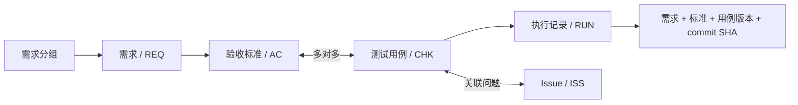

# 任务内容与追溯（2026-09-19）

本次调整取代原始需求／设计文档中的全局、项目原则作用域约定。实际接口以 `/api/v1/schema` version 2 和 API 指南为准。

## 内容归属和列表

- 原则仅属于具体任务；在任务的「基本原则」页维护，在概览采用已确认的版本基线。顶层不再提供原则入口。
- 待办可以是全局灵感，也可以属于一个任务。顶层待办汇总两者；「归属任务」操作可将全局想法移入既有任务。任务内快捷录入会自动附带 taskId。
- 需求分组是任务内独立的 `requirement_group` 记录，通过 `groupId` 关联需求。重命名分组不改动成员需求版本；非空分组不能直接归档。
- 需求、用例、设计、实施、问题、待办、原则、执行记录默认使用紧凑行，展开查看正文。工程内容列表有编号／内容搜索和每页 25、50、100 条选项，手机上自动换行。
- 需求有「当前需求」「拒绝列表」「回收站」三个入口。拒绝与删除都保存原因、操作者、时间和原状态；仅 Owner 能操作。恢复回到待确认状态，旧证据需要复验。关联标准、用例、执行、历史快照不会被级联删除。

## 追溯模型

用例支持前置条件、步骤、预期结果、类型、必需标记、自动化定位，以及多个 `criterionIds`。一个用例可以覆盖不同需求的标准；一个标准也可以由多个用例验证。允许先创建未关联的用例，界面明确标记为「未关联」；必需用例未关联标准时，任务无法通过最终验收。

需求展开后列出每条标准对应的用例；用例展开后列出需求、标准、全部执行和关联问题；执行显示当次绑定的精确版本。编号链接定位并展开目标条目，包括拒绝列表中的需求。质量矩阵和 CSV 同时携带编号、版本与执行记录，便于跨报告核对。

`GET /api/v1/tasks/:id/traceability` 返回双向关系、最新执行、覆盖矩阵、无标准需求、未覆盖标准、未关联用例、待复验用例和范围外用例。任务上下文与矩阵报告也包含这些结构，Agent 和界面使用同一计算逻辑。

## 有效性和统计口径

执行结果必须包含本用例关联的全部 `requirementVersions`、`criterionVersions`、`checkVersion`，并记录实际运行的 40 位 `codeRef`。服务端拒绝陈旧或无关的版本映射。报告使用服务器最后接收的执行记录；人工豁免同样绑定需求版本；需求改变后原豁免失效。需求、标准、用例或目标代码变化后，旧执行显示「待复验」。历史证据仍可以打开浏览。

拒绝／删除的需求及其标准退出当前验收范围；只关联这些标准的用例显示「范围外」。若用例同时关联当前和范围外标准，当前标准仍正常参与验收。范围外关联和历史结果仍保留在追溯图中。已有手动 Issue 阻塞项保持其显式状态，需人工评估处理。

报告的通过率按适用验收标准去重计算；所有必需用例都通过才算标准通过。可选用例失败单独展示，不替代必需用例门槛。不适用和有版本绑定的豁免沿用原有单独统计规则。

## 升级与数据保留

启动时运行幂等事务迁移：将历史全局／项目原则复制到适用的现有任务，复制所有版本和评审，替换任务已采用原则与人工核对记录中的 ID。原始原则归档保留，旧报告不改写；已关闭任务的状态保持原样。没有适用任务的历史原则仍保留在归档数据中。未来任务不会自动继承旧的全局原则。

历史执行若没有记录需求版本，不会补造版本信息，会被判为待复验。外部 Agent 升级时先重新读取 schema，再提交包含 `requirementVersions` 的新结果。旧 `quality-checks` 接口继续兼容，新增更直观的 `test-cases` 别名。

当前分页在前端完成：界面仍通过已有批量接口加载个人工作空间内容。大量条目不会同时渲染在页面上；十万级记录量的服务端过滤、索引搜索和虚拟滚动仍属于后续扩展。关联设计章节、代码符号、PR 与 CI 自动回写也尚未实现。
